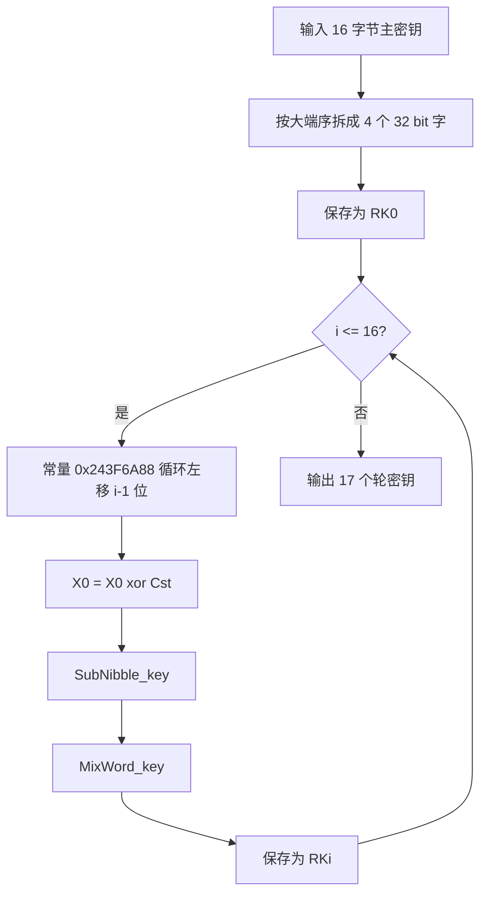
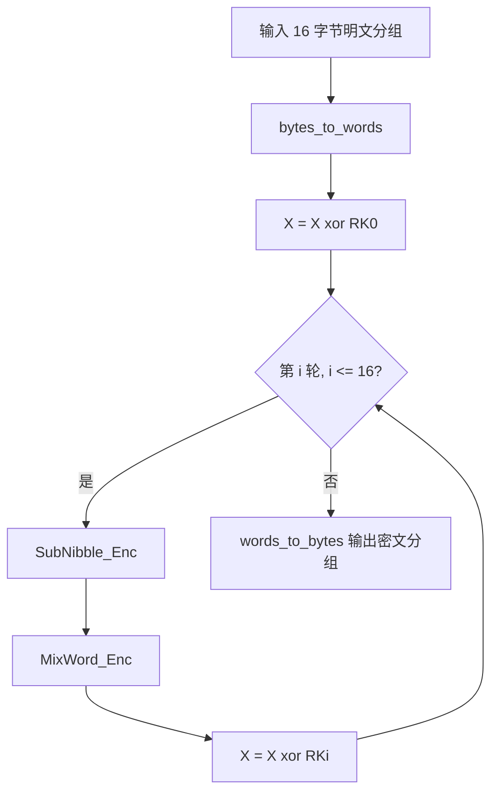
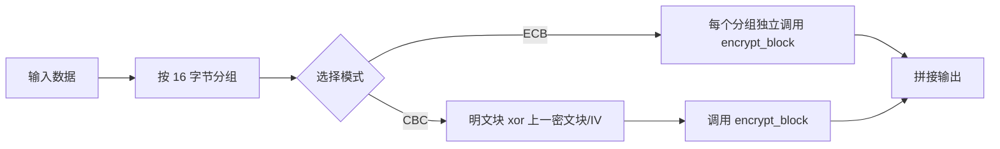

# FESH 分组密码算法实验报告

## 1. 实验目的

本次实验的目标是调研 FESH 分组密码算法并完成密钥扩展、单分组加解密、ECB 和 CBC 两种工作模式、正确性验证、吞吐量评估，最后对 `紫貂.bmp` 进行图片加密实验。这里我选择了自己比较擅长的 Python 语言来实现，选择的版本是`FESH-128-128` 版本。

## 2. 算法来历与背景

FESH 是清华大学、山东大学提出的分组密码算法，设计者为贾珂婷、董晓阳、魏淙洺、李铮、周海波、丛天硕。由于分组密码算法需要在安全性、实现效率和平台适应性之间取得平衡：一方面要支持常见安全级别的分组长度和密钥长度，另一方面又要能在通用 CPU、嵌入式处理器、ASIC、FPGA 等软件和硬件平台上高效实现，所以该团队设计了FESH算法。

FESH 共支持如下 6 个版本：

| 版本 | 分组长度 | 密钥长度 | 轮数 |
| --- | --- | --- | --- |
| FESH-128-128 | 128 bit | 128 bit | 16 |
| FESH-128-192 | 128 bit | 192 bit | 20 |
| FESH-128-256 | 128 bit | 256 bit | 20 |
| FESH-256-256 | 256 bit | 256 bit | 24 |
| FESH-256-384 | 256 bit | 384 bit | 28 |
| FESH-256-512 | 256 bit | 512 bit | 28 |

从设计思想上看，FESH 采用比较常见的替换-置换网络，即 SPN 结构。SPN 结构的基本思想是反复交替使用非线性替换层和线性扩散层，使明文和密钥之间形成复杂关系。课上重点介绍过的AES算法也是 SPN 类型算法，而 FESH 在实现方式上又类似 AES 竞赛中的 Serpent 算法，采用比特切片方式进行设计。比特切片的优点是可以把多个比特位置上的相同操作合并成机器字级别的按位运算，便于软件并行和硬件电路实现。我个人理解从AES到FESH的改进就是一种软件设计贴合硬件逻辑的过程，在总体算法思想基本不变的情况下通过更贴合硬件的算法逻辑，来降低硬件的冗余计算，以此提高效率。

FESH 与 Serpent 类似，都重视可并行实现和安全冗余；不同之处在于 FESH 采用了设计文档中给出的 4 位 S 盒，并使用基于 4 分支 Feistel 结构思想的扩散层。这样的设计使得轮函数比较简洁，主要操作集中在异或、循环移位、按位与、按位或、按位取反等基本位运算上。

## 3. 算法总体框架

我要实现的 `FESH-128-128` 版本每个分组为 16 字节。读入一个分组后，程序按大端序把它拆成如下所示4 个 32 bit 字：

| 状态字 | 字节范围 | 含义 |
| --- | --- | --- |
| `X0` | `block[0:4]` | 第 1 个 32 bit 字 |
| `X1` | `block[4:8]` | 第 2 个 32 bit 字 |
| `X2` | `block[8:12]` | 第 3 个 32 bit 字 |
| `X3` | `block[12:16]` | 第 4 个 32 bit 字 |

加密过程为：

1. 将明文分组 `P` 转换为状态 `X`。
2. 执行白化操作：`X = X xor RK0`。
3. 对 `i = 1...16` 执行轮函数：
   `SubNibble_Enc -> MixWord_Enc -> xor RKi`。
4. 将最终状态转换回 16 字节密文。

解密过程与加密方向相反。程序先使用逆序轮密钥，然后每轮执行：
`MixWord_Dec -> SubNibble_Dec -> xor RKi`。

按照实验的需求，我把整个算法拆分为成三层：第一层是单个分组的 FESH 核心变换，第二层是工作模式（本实验采用ECB/CBC 分组模式），第三层是测试，包括图片文件加密和测试向量处理对比。这样做的好处是每层职责清楚，如果测试向量不通过，可以判断问题是在轮函数、密钥扩展，还是工作模式封装。

## 4. 数据结构设计与设计思路

根据刚刚的算法框架设计，我将代码主要分为三个部分，在 `fesh_core.py` 里写 FESH 的核心变换，在 `fesh_modes.py` 里面写明 ECB/CBC 工作模式，最后在 `test_fesh.py` 里面进行调用和测试。其主要数据结构如下：

| 数据结构 | 对应代码 | 作用 |
| --- | --- | --- |
| 32 bit 整数 | `int` 加 `MASK32` | 保存一个 word，并用掩码限制到 32 bit |
| 分组状态 | `list[int]`，长度为 4 | 保存 `[X0, X1, X2, X3]` |
| 轮密钥表 | `list[list[int]]`，长度为 17 | 保存 `RK0` 到 `RK16` |
| 算法对象 | `FESH128128` | 封装主密钥、轮密钥扩展、单分组加密和单分组解密 |
| 文件数据 | `bytes` | 保存明文、密文、BMP 文件内容 |

最开始设计时，我考虑过直接使用一个 128 bit 大整数表示整个分组，但这样写 S 盒和扩散层时需要频繁切分和合并字段，代码不直观，也不容易与 C++ 参考实现对照。设计文档和参考代码都把 128 bit 分组表示为 4 个 32 bit 字，所以我最终选择 `list[int]` 保存 4 个 word。这样 `SubNibble`、`MixWord`、密钥扩展中的变量 `r0`、`r1`、`r2`、`r3` 都能直接按照参考代码翻译，降低出错概率。

另一个在调试过程中碰到的问题是 Python 整数没有固定宽度。C++ 中 `unsigned int` 的 `~x` 会自然截断到 32 bit，但 Python 中 `~x` 会得到负数。因此在所有取反和中间结果后，我都使用 `0xFFFFFFFF` 进行截断，例如：

```python
r1 = (~r1) & MASK32
```

还有一个问题，我一开始在每个分组加密时都重新扩展密钥，结果 demo 运行明显变慢。后来把密钥扩展结果缓存在算法对象内部，让轮密钥使用缓存属性 `encryption_subkeys` 和 `decryption_subkeys`，同一个密钥加密大量分组时只扩展一次，使运行过程得到提速。

## 5. 编程流程图

### 5.1 密钥扩展流程



### 5.2 单分组加密流程



### 5.3 ECB 和 CBC 模式流程



## 6. 关键函数设计

为了实现算法，我先找出本实验中与算法直接相关的主要函数，然后逐个实现关键函数，最终实现完整功能。列出的关键函数如下：

| 函数 | 作用 |
| --- | --- |
| `bytes_to_words(block)` | 把 16 字节分组转成 4 个 32 bit 字 |
| `words_to_bytes(words)` | 把 4 个 32 bit 字转回 16 字节 |
| `sub_nibble_enc(x)` | 加密 S 盒层 |
| `mix_word_enc(x)` | 加密扩散层 |
| `sub_nibble_dec(x)` | 解密逆 S 盒层 |
| `mix_word_dec(x)` | 解密逆扩散层 |
| `FESH128128.expand_key()` | 生成轮密钥 |
| `FESH128128.encrypt_block()` / `FESH128128.decrypt_block()` | 单分组加解密，位于 `fesh_core.py` |
| `encrypt_ecb(cipher, data)` / `decrypt_ecb(cipher, data)` | ECB 模式，位于 `fesh_modes.py` |
| `encrypt_cbc(cipher, data, iv)` / `decrypt_cbc(cipher, data, iv)` | CBC 模式，位于 `fesh_modes.py` |
| `encrypt_bmp(input_path, output_path, cipher, mode)` | 保留 BMP 文件头并加密像素数据，位于 `fesh_modes.py` |

ECB 模式比较直接，代码逻辑就是遍历每个 16 字节分组并调用 `encrypt_block`。CBC 模式增加了分组间的链接关系，本实验默认使用全 0 IV，与参考 C++ 实现保持一致。CBC 加密时调用关系可以理解为：

```python
encrypted = cipher.encrypt_block(xor_bytes(plaintext_block, previous_block))
previous_block = encrypted
```

其中第一个分组的 `previous_block` 为 IV，后续分组的 `previous_block` 为上一分组密文。这里如果要修改加密使用的IV，可以在test_fesh中调用encrypt_cbc()函数时传入第三个参数作为IV，如果没有传第三个参数就是默认调用全0 IV。

## 7. 正确性验证

关于正确性的验证我全部写在了test_fesh.py中，程序完成了三类验证：

| 验证内容 | 结果 |
| --- | --- |
| ECB/CBC 官方测试向量 | `38/38 passed` |
| 自定义回环测试 | ECB、CBC 均满足 `decrypt(encrypt(P)) == P` |
| Python 语法检查 | `python -m py_compile fesh_core.py fesh_modes.py test_fesh.py` 通过 |

测试时发现 CBC 第 9 组测试向量中 `p.dat` 和 `c.dat` 的长度不一致：明文长度为 217088 字节，密文长度为 512000 字节。由于分组密码模式验证要求明文和密文长度对应，这一组无法作为等长加解密测试，因此我认为这组数据有误，将它记录为不一致用例并跳过。其余长度一致的向量全部通过，说明字节序、密钥扩展、轮函数和工作模式实现与参考材料一致。

## 8.1 吞吐量评估

吞吐量评估的测试我也写在了 `test_fesh.py` 中。为了观察不同统计方式对结果的影响，我设计了两组测试：

第一组是大文件最优值测试。程序生成 1 MiB 测试数据，每种模式运行 3 次，取其中最快的一次计算吞吐量。这样做和最初的设计一致，主要用于观察在较大数据量下 ECB 和 CBC 的速度差异。

| 模式 | 1 MiB 数据，3 次取最优 |
| --- | --- |
| ECB | 本次运行约 0.2447 MiB/s |
| CBC | 本次运行约 0.2508 MiB/s |
| 差距 | ECB 相对 CBC 约 -2.42% |

第二组是小文件平均值测试。程序生成 16 KiB 测试数据，每种模式运行 100 次，并且交替测试 ECB 和 CBC（这样是为了避免先测完一种模式再测另一种模式带来的系统状态偏差，这样可以最大程度上保证两种模式的运行环境相似），最后使用 100 次运行时间的平均值计算吞吐量。这样比只取最快的一次更能反映普通运行情况下的速度。

| 模式 | 16 KiB 数据，100 次平均 |
| --- | --- |
| ECB | 本次运行约 0.2608 MiB/s |
| CBC | 本次运行约 0.2497 MiB/s |
| 差距 | ECB 相对 CBC 约 +4.42% |

但是实验的结果貌似不符合预期，从理论上看，CBC 加密比 ECB 多一步“当前明文块与上一密文块异或”的操作，因此 CBC 应该略复杂一些。但是本实验的结果中，两种模式的差距并不稳定：在大文件最优值测试中，我本来希望通过较大数据量观察更明显差距，但本机这次运行中 CBC 反而略快；小文件 100 次平均测试中 ECB 略快，但差距也只有几个百分点。我认为其原因是在纯 Python 顺序实现中，真正占主要时间的是 `encrypt_block` 内部 16 轮 FESH 核心变换，CBC 多出来的 16 字节异或开销相对较小，容易被 Python 解释器开销、函数调用、系统调度、CPU 状态波动等因素掩盖。

另外，ECB 的理论优势在于分组之间互不依赖，可以进行并行加密；但由于本实验中的 `encrypt_ecb` 仍然是顺序循环调用 `encrypt_block`，没有真正发挥 ECB 可并行的特点。因此从实际测试看，ECB 和 CBC 的吞吐量比较接近，但这并不代表二者在理论并行性上相同。

### 8.2 后续改进方向

ECB 模式理论上支持分组并行，而这也是我预测ECB模式性能要强于CBC模式的原因，但本实验 Python 实现采用顺序循环处理分组，未利用 ECB 的并行性；因此实测吞吐量与 CBC 接近。想要用纯python实现并行计算比较困难，不过后续可以考虑采用多进程、NumPy 向量化或 C/C++ 扩展实现，这样的话ECB 可以获得更明显的并行加速，而 CBC 加密由于存在前后分组依赖，不适合直接并行，所以应该可以达到ECB速度更快的预期。

## 9. BMP 图片加密实验

### 9.1 实验方法

BMP 文件由文件头和像素数据组成。如果把整个 BMP 文件全部加密，文件头会被加密为无意义的数据，这样的话操作系统就无法识别它是什么文件，而实验的要求是将此图加密为另一张毫不相干的图，因此要保留文件头（不进行加密）。实现中首先读取 BMP 文件头中的像素数据偏移量：

```python
pixel_offset = int.from_bytes(raw[10:14], "little")
header, body = raw[:pixel_offset], raw[pixel_offset:]
```

本图片 `紫貂.bmp` 的像素数据偏移为 54 字节，所以保留前 54 字节，只对后面的像素数据加密。如果像素数据长度不是 16 的倍数，就补 0 到 16 字节边界；本次图片加密后文件大小仍为 2764854 字节。

实际调用的核心函数为 `encrypt_bmp()`。调用过程等价于：

```python
from pathlib import Path
from fesh_core import FESH128128
from fesh_modes import encrypt_bmp

key = bytes.fromhex("a0a3a2a5a4a7a6a9abaca2a9a3a7a2a8")
cipher = FESH128128(key)

encrypt_bmp(Path("紫貂.bmp"), Path("output/紫貂_fesh128128_ecb.bmp"), cipher, "ecb")
encrypt_bmp(Path("紫貂.bmp"), Path("output/紫貂_fesh128128_cbc.bmp"), cipher, "cbc")
```

### 9.2 实验结果

输出文件如下：

| 模式 | 输出文件 | 文件头检查 |
| --- | --- | --- |
| ECB | `output/紫貂_fesh128128_ecb.bmp` | 仍以 `BM` 开头，偏移为 54 |
| CBC | `output/紫貂_fesh128128_cbc.bmp` | 仍以 `BM` 开头，偏移为 54 |

从显示效果看，两张加密图都已经无法还原出原图的颜色和纹理，说明像素数据确实被加密。但是ECB 图中仍能隐约看到原图主体轮廓，不过这也符合我们的预期，因为 ECB 对相同明文块会产生相同密文块，图片中相似区域加密后某些特征可能仍相似，所以会有大概的轮廓。CBC 图基本呈现为随机噪声，主体轮廓不再明显，这是因为 CBC 会把前一个密文块引入当前分组加密，使相同明文块在不同位置也会得到不同密文。这也告诉我们：CBC 比 ECB 更适合隐藏图片中的结构信息。

## 10. 实验总结

本次实验完成了 FESH-128-128 的 Python 实现，并实现了 ECB 和 CBC 两种工作模式。通过测试向量验证可以确认核心算法与参考实现一致；通过吞吐量测试可以看到纯 Python 位运算实现的性能有限；通过 BMP 图片加密实验可以直观看到 ECB 和 CBC 的差别。

对我来说，本实验中最关键的部分不是把代码简单翻译出来，而是保持数据表示的一致性。分组密码里一个字节序错误、一次未截断的取反操作，都可能导致全部测试向量失败。因此我在设计数据结构时尽量贴近文档和 C++ 代码，用 4 个 32 bit word 表示状态，用 17 个轮密钥表示密钥扩展结果，再在外层封装工作模式和文件处理。这样实现层次比较清楚，也便于定位和解释实验结果。

最终在对实验结果分析的过程中，虽然产生了一些不符合预期的结果，不过这也给我带来了一些新的思考和认识，最直观的就是python虽然语法和结构相比于C\C++更简单，但是对于硬件行为的控制更弱，或者说更不精确，而这也导致了在密码算法的实现这种对基础运算、变换、运算效率极度敏感的项目中，python编程的优先级要低于C\C++这种更底层的编程语言。选择的重要性有时是大于努力的，所以下次在实现项目之前我会慎重决策采用的编程语言，减少这种“事倍功半”的情况发生。

(注：本项目仓库已同步到git仓库中，具体地址为：，后续如果有新思路和改进会实时同步)
